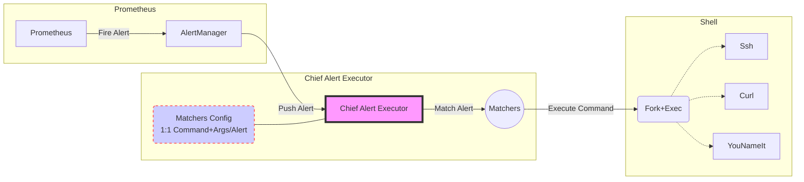

# Chief Alert Executor

Receives Prometheus Alerts, Matches them with rules, and then executes the
configured scripts with the provided arguments

## How does this work?



## Configuring Matchers

A sample configuration for a single alert matcher that would match the
[testing alert][1] payload would look like this:

```yaml
---
matchers:
  - command: echo
    args: ['captured NonEphemeralHostIsDown for myhostname alert']
    labels:
      alertname: ^NonEphemeralHostIsDown$
      hostname: ^myhostname$
    annotations:
      host_tier: ^myhostname$
```

## Announcing to Slack

To announce to slack it's necessary to setup an environment variable named
**SLACK_URL** containing an incomming webhook url, and at the very least a set
of default templates in the top level of the configuration file to render the
messages to slack

```yaml
default_template:
  on_match: 'Matched Alert: {{ .AlertGroup.CommonLabels.alertname }}'
  on_success: 'Success executing matcher {{ .Match.Name }}: {{ .Output }}'
  on_failure: 'Failure executing matcher {{ .Match.Name }}: {{ .Err }}'
```

Additionally, any matcher may contain a template definition with the same
block defined inside the scope of the matcher. In this case, the specific
matcher template will override the default templating configuration.

These templates are parsed and expanded using Go `text/template` package, so
refer to the Go language documentation for further explanations.

If the environment variable is not present, a null messenger will be used
which will log all the messages at debug level for debugging purposes.

## Arguments

### -address string

Address to listen to (default ":9099")

### -config string

Configuration filename (default "config.yml")

### -debug

Enable debug mode

### -metrics string

Path in which to listen for metrics (default "/metrics")

## Endpoints

### /webhook

Endpoint to which the alertmanager should be configured to point at.

### /-/health

Endpoint that will return 200 when the service is healthy.

### /-/reload

Post to this endpoint to reload configuration while the process is running.

### /metrics

By default prometheus metrics are published here.

## AlertManager Sample Configuration

Start by defining a receiver which points at the webhook endpoint, skipping
resolved alerts.

```yaml
---
receivers:
- name: chief-alert-executor
  webhook_configs:
    - url: http://<chief alert executor-ip>:9099/webhook
      send_resolved: false
```

Then add it to the list of routes.

```yaml
# We want to send all alerts to chief alert executor and then continue to the
# appropiate handler.
route:
  routes:
  - receiver: chief-alert-executor
    continue: true
```

## Running in Kubernetes

Chief Alert Executor provides a [sample configuration][2] to run in
kubernetes.

## Disclaimers

### Common Labels and Annotations

Mind the fact that labels and annotations map to CommonLabels and
CommonAnnotations.

This means that chief-alert-executor will trigger one command execution for a
set of alerts that have been grouped by the alert manager.

This is by-design to keep the matching simple and predictable.

### No capturing to prevent injections

No argument capturing is possible. Executed commands and arguments are a 1 to 1
mapping with a matching, without any form of variable arguments. Thus, it's
not possible to link alert fields with arguments. This is specifically so to
avoid injecting arguments through payloads.

### No firing/resolved filtering

This tool can be used as an auto-remediation building block, but there's a
caveat: the tool is dumb and will execute the configured script every time it
receives an alert.

This means that you must be careful when setting up commands **and** alerts.
Particularly how they are being grouped and how often they are triggered.

As a general recomendation, _resolved_ alerts should not be sent as the tool
is not filtering for firing/resolved alerts.

[1]: ./internal/webhook/sample-payload.json
[2]: ./k8s/
